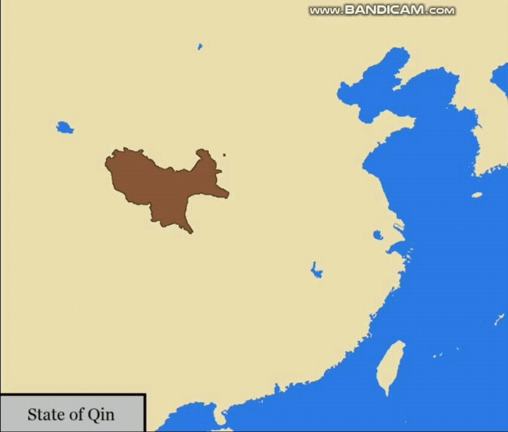
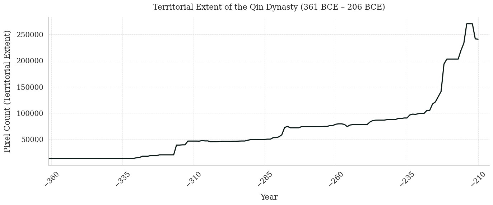

# ATDE: Animated Territorial Data Extractor

A computer vision tool for extracting quantitative territorial data from animated historical map videos.

<p align="center">
  
  
</p>
<p align="center">
  <em>Left: Original animated map video | Right: ATDE validation output showing detected territory</em>
</p>

<p align="center">
  
</p>
<p align="center">
  <em>Extracted territorial trajectory for the Qin Dynasty (361-206 BCE) showing pixel counts over time</em>
</p>


## Overview

**ATDE (Animated Territorial Data Extractor)** converts animated historical map videos into structured time-series data. Many popular "history-of-the-world" videos depict territorial changes using color-coded regions, but the underlying quantitative data remains inaccessible. ATDE uses HSV-based color segmentation, RGB channel filtering, and Direct-Neighbor Filtering to extract pixel counts representing territorial control over time.

**Key Features:**
- Extracts year-by-year territorial pixel counts from animated map videos
- Handles multiple color shades representing the same territory
- Includes validation video output for quality control
- No pre-existing shapefiles required
- Configurable filtering to handle noise and similar colors

**Note:** ATDE extracts data from animated visualizations, not primary historical sources. For rigorous historical research, consult authoritative datasets and academic sources.

## Installation

### Requirements
- Python 3.7+
- OpenCV (cv2)
- NumPy <2.0 (NumPy 2.x is not yet supported)
- Matplotlib (for visualization)

### Setup
```bash
# Clone the repository
git clone https://github.com/hamzaalshamy/animated-territorial-data-extractor
.git
cd animated-territorial-data-extractor


# Install dependencies
pip install opencv-python "numpy<2.0" matplotlib
```

## Quick Start

### Basic Usage
```python
from ATDE import ATDE

# Define territory colors (RGB format)
dynasty_colors = [
    [47, 170, 235],
    [103, 207, 254],
    [201, 238, 254]
]

# Extract territorial data
pixel_counts = ATDE(
    video_path='condensed_videos/song_dynasty.mp4',
    main_colors=dynasty_colors,
    start_year=960,
    end_year=1279,
    output_path='validation/song_validation.mp4',
    green_restriction='>150'  # Optional: filter out ocean pixels
)

# pixel_counts is a dictionary: {year: pixel_count}
print(pixel_counts)
```

### Complete Example

See `ATDE_application.ipynb` for a complete example demonstrating:
1. Extracting territorial data for multiple dynasties
2. Normalization and visualization

## Repository Structure
```
ATDE/
├── ATDE.py                    # Main extraction function
├── ATDE_application.ipynb     # Complete example notebook
├── condensed_videos/          # Preprocessed video inputs
├── validation/                # Validation video outputs
├── paper.pdf                  # Technical paper describing methodology
└── README.md
```

## Function Parameters

### `ATDE()`

**Required Parameters:**
- `video_path` (str): Path to input video file
- `main_colors` (list): List of RGB color tuples representing territory
- `start_year` (int): Starting year of the analysis
- `end_year` (int): Ending year of the analysis

**Optional Parameters:**
- `hsv_range` (int, default=10): Hue tolerance in HSV space
- `lower_sv` (int, default=100): Lower bound for saturation/value
- `upper_sv` (int, default=255): Upper bound for saturation/value
- `min_neighbors` (int, default=5): Minimum neighbors for noise filtering (0-8)
- `output_path` (str, optional): Path to save validation video
- `red_restriction` (str, optional): Red channel filter (e.g., '<150' or '>100')
- `green_restriction` (str, optional): Green channel filter
- `blue_restriction` (str, optional): Blue channel filter

**Returns:**
- Dictionary mapping years to pixel counts: `{year: pixel_count}`

## How It Works

### 1. Color Detection
ATDE converts RGB colors to HSV (Hue, Saturation, Value) space, which better handles multiple shades of the same color. You specify seed colors, and ATDE detects all pixels within a configurable HSV range.

### 2. RGB Channel Filtering
If territory colors are similar to background elements (e.g., ocean), you can apply RGB channel restrictions to separate them:
```python
green_restriction='>150'  # Keep only pixels with green > 150
```

### 3. Direct Neighbor Filtering (DNF)
Removes isolated pixels and noise by requiring each detected pixel to have a minimum number of detected neighbors (default: 5 out of 8).

### 4. Validation Video
ATDE generates a validation video showing which pixels were detected in each frame, allowing you to visually verify extraction accuracy.

## Example: Chinese Dynasties

The included notebook demonstrates extracting territorial data for ten major Chinese dynasties (200 BCE – 1912 CE):

- Qin, Han, Jin, Sui, Tang, Song, Jurchen Jin, Yuan, Ming, Qing

The extracted trajectories align with established historiographic periodizations and enable comparative analysis of expansion patterns, territorial stability, and collapse dynamics.


<!-- ## Citation

If you use ATDE in your work, please cite:
```bibtex
@article{alshamy2025atde,
  title={Animated Territorial Data Extractor (ATDE): A Computer-Vision Method for Extracting Territorial Data from Animated Historical Maps},
  author={Alshamy, Hamza and Woram, Isaiah and Mirsha, Advay and Xia, Charlie and Wallisch, Pascal},
  journal={arXiv preprint arXiv:XXXX.XXXXX},
  year={2025}
}
``` -->

## Paper

Read the full technical paper: [paper.pdf](ATDE_paper.pdf) 
 <!-- or on [arXiv](https://arxiv.org/abs/XXXX.XXXXX) -->


## License

[MIT License](LICENSE) - feel free to use and modify for your projects.

<!-- ## Contact

- Hamza Alshamy - ha2486@nyu.edu
- Isaiah Woram - idw2005@nyu.edu
- Advay Mirsha - am11369@nyu.edu
- Charlie Xia - zx1117@nyu.edu
- Pascal Wallisch - pw44@nyu.edu

Center for Data Science, New York University -->

## Acknowledgments

Special thanks to the creators of animated historical map videos whose work inspired this tool.

---

**Disclaimer**: This tool extracts data from animated visualizations and is intended for educational and analytical purposes. It is not a substitute for authoritative historical datasets or primary source research.
